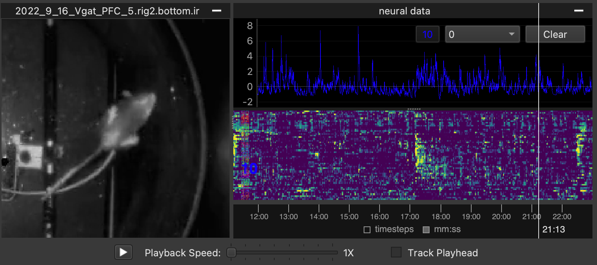

# Summary

A core goal of neuroscience is to discover temporal patterns in behavior and neurophysiology. Though a variety of tools exist to characterize these relationships, there is still no substitute for direct inspection as a way to notice unexpected patterns and generate new hypotheses. To facilitate this process, we have developed the Systems Neuro Browser (SNUB), a graphical user interface for exploring time-series data. SNUB is a flexible, general-purpose tool that allows users to build a dashboard of synchronized data views, including neural recordings, behavioral videos, and annotations derived from these data. 


# Statement of need

Direct inspection of behavior and neurophysiology recordings is hard because the data are typically high-dimensional, come in a variety of modalities (such as raw video, pose tracking, spike trains, calcium traces, etc.) with different sampling rates and methods of visualization. SNUB lowers the activation energy for data exploration by integrating these data streams into a single easy-to-navigate interface. The interface is divided into synchronized windows that each show a different data stream. The linked data views allow users to quickly inspect the relationships between experimental phenomena, such as the behaviors that occur during a particular pattern of neural activity (\autoref{fig:screenshot}). 



We provide dedicated widgets and loading functions for exploring raw video, 3D animal pose, behavior annotations, electrophysiology recordings, and calcium imaging data - either as a raster or as a super-position of labeled regions of interest (ROIs). More broadly, SNUB can dislay any data that takes the form of a heatmap, scatter plot, video, or collection of named temporally-varying signals. 

In addition to the front-end GUI, we include a library of functions that ingest raw data and save it to a format that is readable by the SNUB viewer. The following code, for example, creates a project with paired electrophysiology and video data.

```
snub.io.create_project(project_directory, duration=1800)
snub.io.add_video(project_directory, 'path/to/my_video.avi', name='IR_camera')
snub.io.add_splikeplot(project_directory, 'my_ephys_data', spike_times, spike_labels)
```

We also provide a rudimentary tool for automatically generating SNUB datasets from Neurodata Without Borders (NWB) files, which contain raw and processed data from neuroscience recordings [@NWB]. The data in NWB files are stored hierarchically, and each component of the hierarchy has a specific neurodata type that reflects the measurement modality (e.g, "Units" for spike trains, "ImageSeries" for video). Our conversion tool generates a SNUB display element for each supported neurodata type. Users can optionally restrict this process to a subset of the NWB hierarchy (e.g., include pose tracking while excluding electrophysiology, or include just a subset of electrophysiology measurements). 

SNUB is a flexible general-purpose tool that complements more specialized packages such as rastermap [@rastermap] and Bento [@bento]. The rastermap interface, for example, is hard-coded for the display of neural activity rasters, ROIs and 2D embeddings of neural activity. Bento is hard-coded for the display of neural activity rasters, behavioral videos and behavioral annotations. SNUB can reproduce either of these configurations and is especially useful when one wishes to include additional types of data or more directly customize the way that data is rendered.

The graphics in SNUB are powered by vispy [@vispy]. SNUB includes wrappers for several dimensionality reduction methods, including rastermap [@rastermap] for ordering raster plots and UMAP [@umap] for 2D scatter plots. Fast video loading is enabled by vidio [@vidio]. The app icon was adapted from a drawing contributed to scidraw by Luigi Petrucco  [@petrucco_2020_3925903].

# Acknowledgements

We are grateful to Mohammed Osman for contributions to the 3D keypoint visualization and NWB conversion tools. CW is a Fellow of The Jane Coffin Childs Memorial Fund for Medical Research. SRD is supported by NIH grants U19NS113201, RF1AG073625, R01NS114020, the Brain Research Foundation, and the Simons Collaboration on the Global Brain.

# References